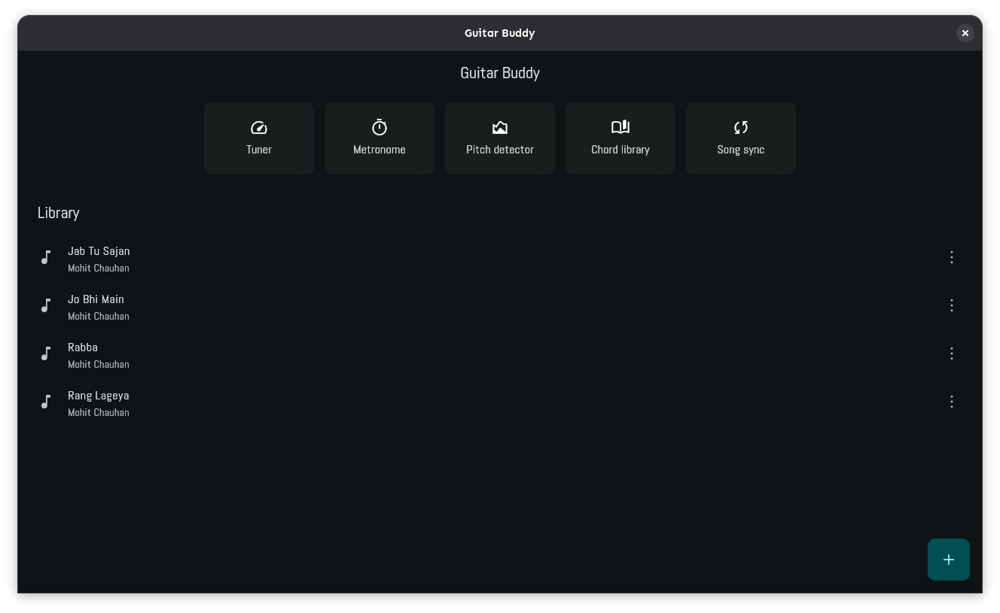
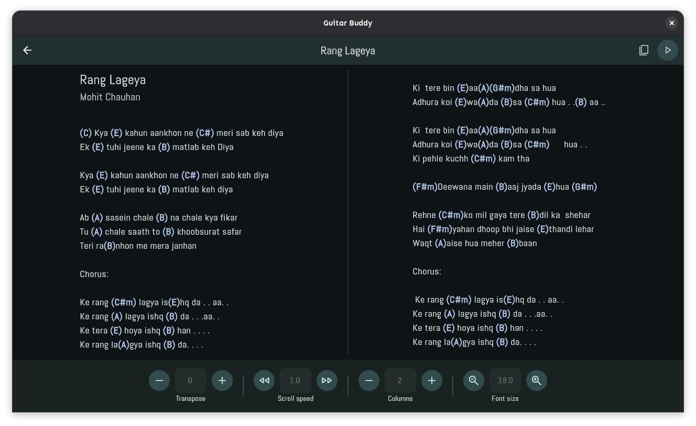
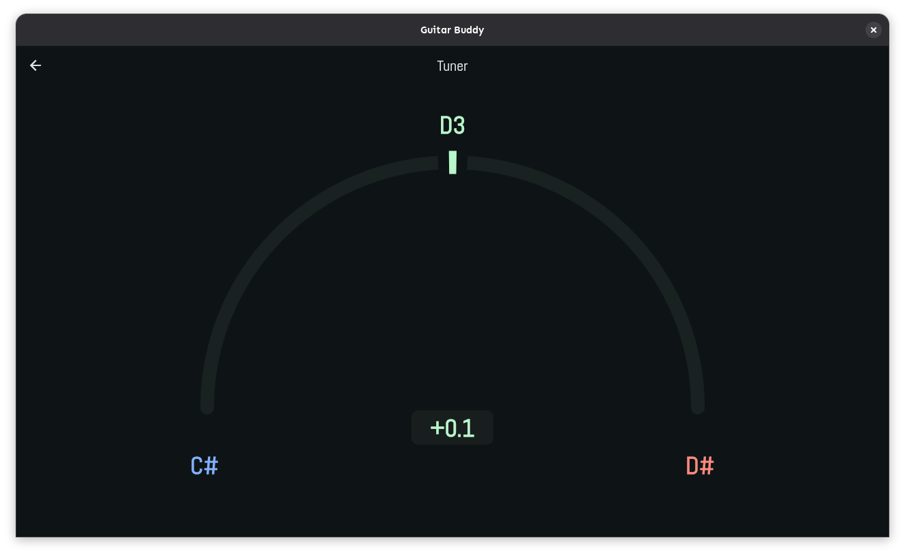
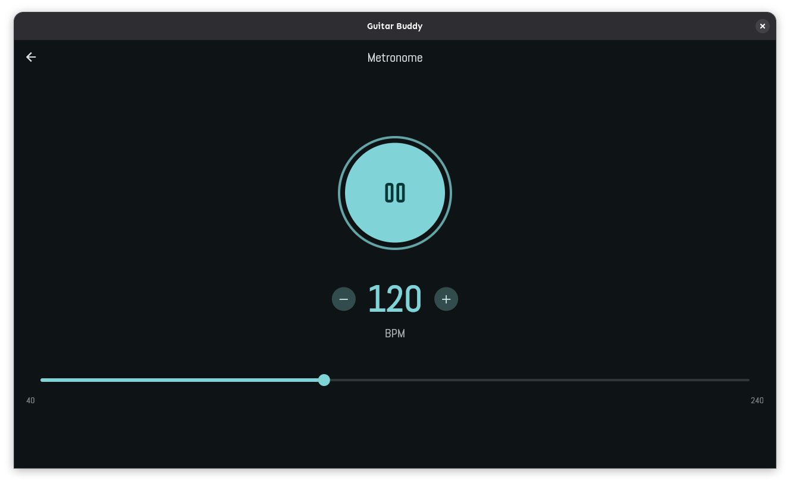
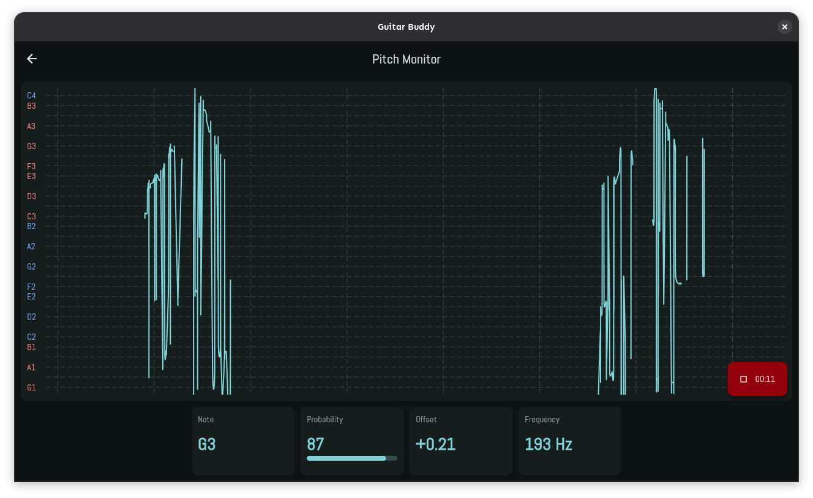

# Guitar Buddy
Guitar utility application.

## Features
1. Chord library
    1. Offline
    2. Transpose
    3. Autoscroll
2. Tuner
3. Metronome
4. Pitch monitor
5. Chord sync from nearby devices (planned)

## Installation

### Android
1. Download apk file from releases.
2. Install it.

### Linux
1. Download AppImage from releases.
2. Execute.

## Screenshots
- Library page
  
- Song page
  
- Tuner
  
- Metronome
  
- Pitch monitor (bad performance due to noise and insufficient post-processing)
  

## Common issues and fixes

### Unable to pinch to change lyrics text size.
1. This occurs because the lyrics section is out of focus after interacting with some other page element.
2. Click on the lyrics section then try pinching to change lyrics size.

### Unstable pitch monitor behaviour.
1. I plan to fix it soon.